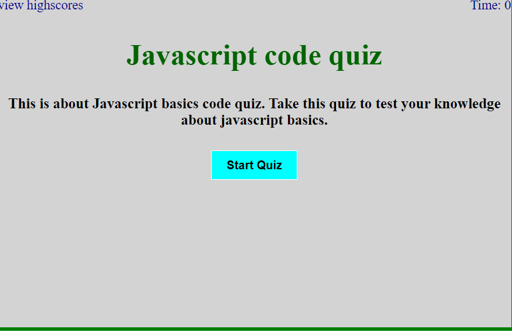
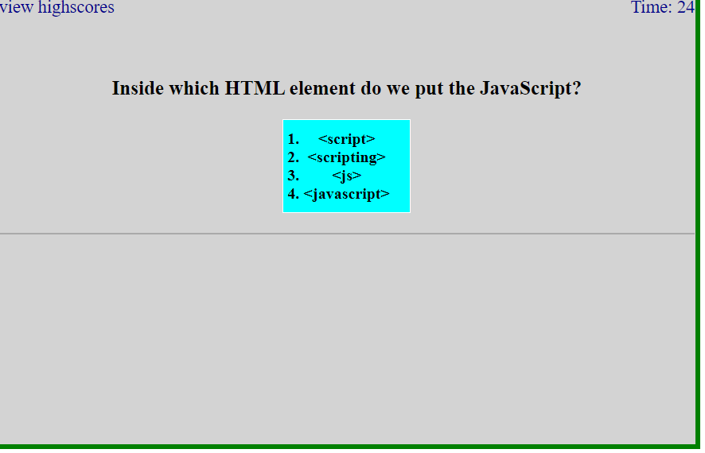
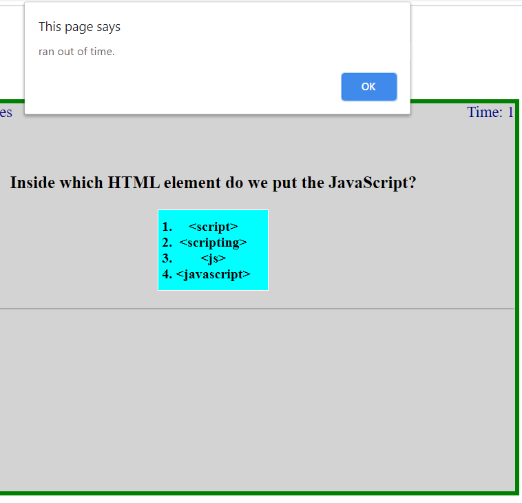
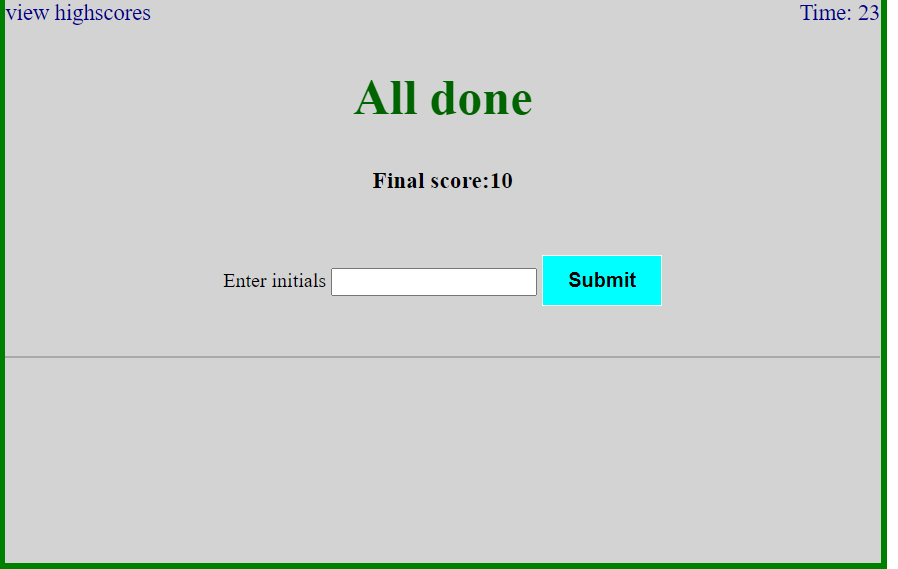
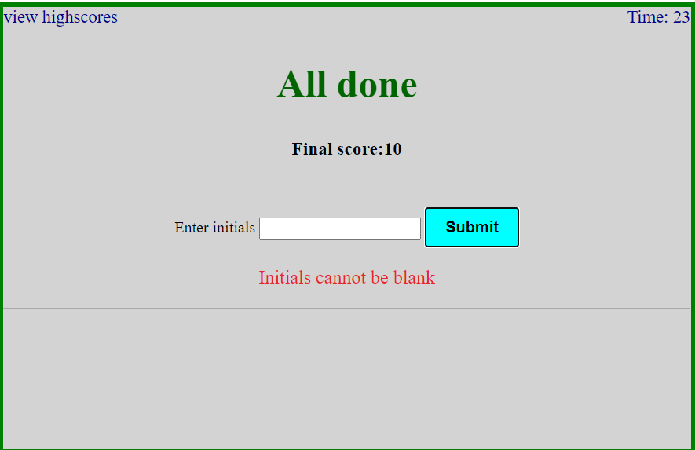
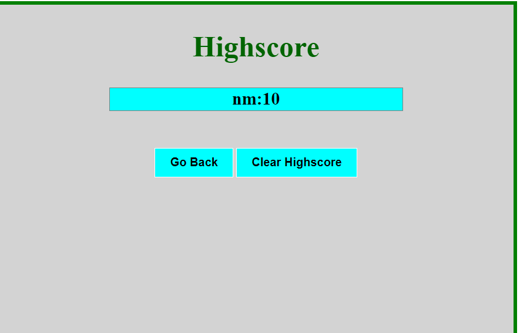
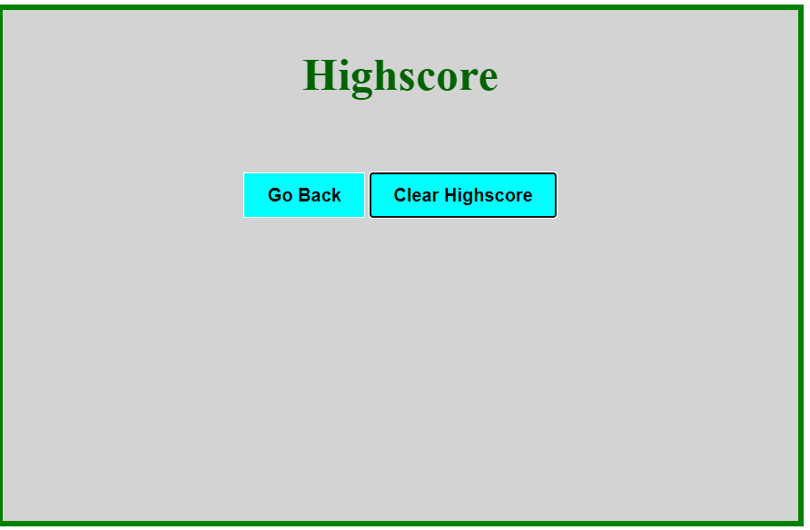

# code-quiz-9.29.20

---

## About The Project

---

Implemented the code to create quiz application.
Once user open the application,the starting page will have following fields and article.

-    header section will have view highScores text and Time.
-    Time will be assigned by value once user clicks on start quiz button.
-    heading.
-    article about quiz app.
-    start quiz button.

When user click on start quiz button,value will be assigned to Time,and count down will start and page will be displayed with question and multiple choice of answers.After user clicks on answer choice,if user selct correct answer then displays word correct or displays word wrong.Then next question displays with multiple choice of answers.This process continues until the end of the question array or until Time reaches to 0 secs.Every time if user selects correct answer score will be increased and will be save in local storage.If user selects wrong answer,time will be deduct from total time.If Time reache to 0 secs before complete the quiz(all questions),alert the message to user and final score page will be displayed.In this page,scores will be retrived from localStorage and user can see total score.In this page user needs to enter initials and click on submit button,this page will navigate to finalscore display page.This page displays user initials and finalscores,Go Back and Clear Highscores buttons.If user clicke on Clear Higscores,it will clear the higscores'
If clicks on Go Back button,it will navigate to starting page of the quiz pp.

## script.js

## script2.js

-    Implemented the following functionalities
-    showQuestion: display the question from 0 index to array.length-1
-    selectAnswer : User clicks one of four choices
-    setTime : to count down the time for every sec.
-    setScores : set scores in localStorage
-    getScores : retrive scores from localStorage.

## index.html

## index2.html

-    Implemented the code for quiz application and display finalscores page

## css

-    added different varieties of styles to html pages using css selectors
-    used id,class and tag selectors

## Built With

-    javascript
-    html
-    css

## Getting Started

To get a local copy up and running follow below steps.

## Prerequisites

None

## Installation

Clone the repo
git clone git@github.com:NirmalaAbothu/code-quiz-9.29.20.git

## Credits

Followed the documentation of https://www.w3schools.com/js/ and google documents

## License & copyright

Copyright © 2020 Nirmala Abothu

## Deployed project link

[code-quiz](https://nirmalaabothu.github.io/code-quiz-9.29.20/)
